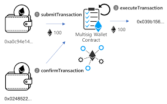

[readme](README.md)

# Introduction aux contrats multisignatures

## __Qu'est-ce qu'un contrat intelligent multisig__

Un contrat intelligent multisig est un type de contrat intelligent qui permet à plusieurs utilisateurs de contrôler une adresse Ethereum. Il est souvent utilisé pour les portefeuilles Ethereum, où les fonds sont stockés dans une adresse Ethereum contrôlée par un groupe de personnes.

>Le fonctionnement du contrat multisig est basé sur la signature de transactions. Lorsqu'un utilisateur souhaite effectuer une transaction à partir de l'adresse Ethereum contrôlée par le contrat multisig, il doit soumettre la transaction au contrat en utilisant sa clé privée. Cependant, pour que la transaction soit exécutée, elle doit également être signée ou confirmée par un certain nombre d'autres utilisateurs, qui ont préalablement donné leur accord pour agir comme signataires.

>Le nombre de signatures ou de confirmation requises pour autoriser une transaction est défini lors de la création du contrat multisig et peut être personnalisé en fonction des besoins de l'utilisateur. Par exemple, un contrat multisig peut être configuré pour exiger la signature de deux sur trois utilisateurs avant qu'une transaction ne soit approuvée.

>Le contrat multisig offre plusieurs avantages par rapport à un portefeuille Ethereum traditionnel contrôlé par une seule personne. Tout d'abord, il offre une sécurité accrue en réduisant le risque de fraude ou de vol, car plusieurs personnes doivent autoriser les transactions. De plus, il offre une plus grande transparence, car toutes les transactions sont enregistrées sur la blockchain Ethereum et sont donc accessibles publiquement. Enfin, le contrat multisig permet de simplifier la gestion des fonds en permettant à un groupe de personnes de contrôler les fonds, plutôt qu'une seule personne.
