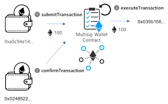

[readme-fr](README-fr.md)
# Introduction to multi-signature contracts

## __What is a multi-sig smart contract?__

A multi-sig smart contract is a type of smart contract that allows multiple users to control an Ethereum address. It is often used for Ethereum wallets, where funds are stored in an Ethereum address controlled by a group of people.

>The operation of the multisig contract is based on transaction signing. When a user wants to perform a transaction from the Ethereum address controlled by the multisig contract, he must submit the transaction to the contract using his private key. However, for the transaction to be executed, it must also be signed or confirmed by a number of other users, who have previously agreed to act as signatories.

>The number of signatures or confirmations required to authorize a transaction is defined when the multi-sig contract is created and can be customized to meet the needs of the user. For example, a multi-sig contract can be configured to require signatures from two out of three users before a transaction is approved.

>The multi-sig contract offers several advantages over a traditional Ethereum wallet controlled by a single person. First, it offers increased security by reducing the risk of fraud or theft, as multiple people must authorize transactions. In addition, it offers greater transparency, as all transactions are recorded on the Ethereum blockchain and are therefore publicly accessible. Finally, the multi-sig contract simplifies the management of funds by allowing a group of people to control the funds, rather than a single person.
